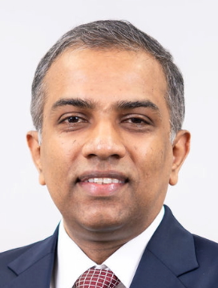

<frontmatter>
  title: Damith Chatura RAJAPAKSE
</frontmatter>
  

    <h1 class="display-5 no-index">Damith Chatura RAJAPAKSE</h1>
  

    

    

    

Associate Professor (Education), School of Computing, Department of Computer Science, National University of Singapore 
PhD, Software Engineering, NUS, 2002-2006 
BSc, Computer Science & Engineering, University of Moratuwa, 1996-2001 

%%:fas-envelope:%% `damith@comp.nus.edu.sg` 
%%:fas-map-marker-alt:%% COM2-02-57 | %%:fas-phone-square:%% 6516 4359 
%%:fas-home:%% https://www.comp.nus.edu.sg/~damithch | %%:fab-github:%% [@damithc](https://github.com/damithc)
    

  

---

## Awards

* [Outstanding Educator Award 2025](https://www.nus.edu.sg/uawards/honour-roll/recipients/damith-chatura-rajapakse)
* NUS Annual Teaching Excellence Honor Roll - 2013 to 2018
* NUS Annual Teaching Excellence Award 2012
* Faculty Teaching Honor Roll - 2013 to 2018
* Faculty Teaching Excellence Award 2012
* NUS Annual Teaching Excellence Award 2011
* SoC Faculty Teaching Excellence Award 2011
* NUS Annual Teaching Excellence Award 2010
* SoC Faculty Teaching Excellence Award 2010

## Projects

Project |  Description |
--- | --- |
[TEAMMATES](https://teammatesv4.appspot.com/) | An online feedback management system for education, used by more than **1.3 million** users ([:fas-home: product website](https://teammatesv4.appspot.com/), [:fab-github: project website](https://github.com/teammates/teammates)). |
[Git-Mastery](https://git-mastery.org) | A learning resource and a companion app for learning Git  ([:fas-home: website](https://git-mastery.org)).|
[SE-EDU](https://se-education.org) | A collection of sample projects and other resources for SE students and teachers  ([:fas-home: website](https://se-education.org)).|
[MarkBind](https://markbind.org) | A tool for generating educational websites from Markdown syntax. ([:fas-home: product website](https://markbind.org/), [:fab-github: project website](https://github.com/markbind/markbind)).|
[RepoSense](https://reposense.org) | A tool to monitor contributions to multiple Git repositories. ([:fas-home: product website](https://reposense.org), [:fab-github: project website](https://github.com/reposense/reposense)).|
[CATcher](https://github.com/CATcher-org/CATcher/) and [WATcher](https://github.com/CATcher-org/WATcher/) |  An app for anonymous peer testing of software products. ([:fas-home: product website](https://catcher-org.github.io/), [:fab-github: project website](https://github.com/CATcher-org/CATcher/)).|
[~~PowerPointLabs~~](http://www.comp.nus.edu.sg/~pptlabs/) %%(now defunct)%% | A productivity plugin for Microsoft PowerPoint estimated to have benefited more than **1,000,000** people ([:fas-home: product website](http://www.comp.nus.edu.sg/~pptlabs/), [:fab-github: project website](https://github.com/powerpointlabs/powerpointlabs)).|

## Books

 |
---|---|---|---|
Available on Amazon | Available on Amazon, chapter author | Available on Amazon, chapter author | %%Online book (now offline)%%

 |
---|---|---
%%Online book (now offline)%% | %%Out of print%% | %%Out of print%%

## Teaching

* [CS2103/T - Software Engineering](https://www.comp.nus.edu.sg/~cs3281)
* [CS3281 - Thematic Systems Project I](https://nus-cs3281.github.io/website/)
* [CS3282 - Thematic Systems Project II](https://nus-cs3281.github.io/website/)
* TIC2002 - Introduction to Software Engineering
* CP3108A/B Independent Studies Courses (project supervision)

Past:

* TIC4001 - Software Engineering Practicum I
* TIC4002 - Software Engineering Practicum II
* TEE3201 - Software Engineering
* CS2113 - Software Engineering and OOP
* FMC1202 - Freshman Seminar: The Wonderfully Weird World of Software
* CS1281 - C++ to Java
* GEM1909 - Technology and Human Progress
* CS3215 - Software Engineering Project (2006-2009)
* CS4217 - Software Development Technologies

## Research

I'm interested in all things related to software engineering in general. In particular, **software engineering education**, Software maintenance, software reuse, and software development best practices.

**Publications**:

1. [POSTER] Rajapakse D. C. "TEAMMATES: A Feedback Management Tool for Teachers"  International Conference on Teaching and Learning in Higher Education (TLHE 2014)
1. [POSTER] Rajapakse D. C. "PowerPointLabs: A Tool for Creating Instructor-independent and Retouchable eLearning Videos"  International Conference on Teaching and Learning in Higher Education (TLHE 2014)
1. [BOOK CHAPTER] Rajapakse, D.C., "Peer Feedback in Software Engineering Courses". Overcoming Challenges in Software Engineering Education: Delivering Non -Technical Knowledge and Skills , edited by Liguo Yu, pp 111-121. Pennsylvania: IGI Global, 2014
1. [BOOK CHAPTER] Rajapakse D. C., Fragmentation of Mobile Applications In Handbook of Research on Mobile Software Engineering: Design, Implementation, and Emergent Applications edited by Paulo Alencar and Donald Cowan, 2012, pp 317-335
1. [POSTER] Rajapakse D. C., Nguyen, V Q H, and Karthivelu, S. P., "A Peer Evaluation and Peer Feedback Tool for Team Projects"  International Conference on Teaching and Learning in Higher Education (TLHE 2011)
1. [PAPER] Rajapakse, D.C., "Some Observations from Releasing Student Projects to the Public". Conference on Software Engineering Education and Training (2011) , 22 - 24 May 2011, Waikiki, Hawaii, United States)
1. [POSTER] Goh, G, X Lai and D.C. Rajapakse, "Teammates: A Cloud-Based Peer Evaluation Tool for Student Team Projects". Conference on Software Engineering Education and Training (Waikiki, Hawaii, United States)
1. [POSTER] Lu, Z., and Rajapakse, D. C., "Porting Mobile Applications: Results from the “100 Phones Experiment”," Poster presented at 7th Annual International Conference on Mobile Systems, Applications and Services (MobiSys’09) June 22-25, 2009 in Kraków, Poland
1. [JOURNAL PAPER] Rajapakse D. C., and Jarzabek, S. "Towards generic representation of web applications: solutions and trade-offs," Software—Practice & Experience, Volume 39 , Issue 5 (April 2009), pp 501-530
1. [CONFERENCE PAPER] Rajapakse, D. C., "Techniques for De-fragmenting Mobile Applications: A Taxonomy," 20th Intl. Conf. on Software Engineering and Knowledge Engineering Conference (SEKE'08), San Francisco, USA, July 2008
1. [CONFERENCE PAPER] Peng, D., Jarzabek,S., Rajapakse, D.C., Zhang, H., "Reuse of Database Access Layer Components in JEE Product Lines: Limitations and a Possible Solution (Case Study)," 19th Intl. Conf. on Software Engineering and Knowledge Engineering Conference (SEKE'07), Boston, USA, July 2007
1. [CONFERENCE PAPER] Rajapakse, D.C. and Jarzabek, S. “Using Server Pages to Unify Clones in Web Applications: A Trade-off Analysis,” Int. Conf. Software Engineering, ICSE’07, Minneapolis, USA, May 2007 (acceptance rate 15%)
1. [CONFERENCE PAPER] Rajapakse, D. C., and Jarzabek, S., "An Investigation of Cloning in Web Applications," 5th Intl Conference on Web Engineering (ICWE'05), Sydney, Australia, 2005 (acceptance rate 19%)
1. [CONFERENCE PAPER] Rajapakse, D. C., and Jarzabek, S., "A Need-Oriented Assessment of Technological Trends in Web Engineering," 5th Intl Conference on Web Engineering (ICWE'05), Sydney, Australia, 2005
1. [CONFERENCE PAPER] Basit, H. A., Rajapakse, D. C., and Jarzabek, S., "An Empirical Study on Limits of Clone Unification Using Generics," 17th Intl. Conference on Software Engineering and Knowledge Engineering (SEKE'05), Taipei, Taiwan, 2005
1. [CONFERENCE PAPER] Basit, H. A., Rajapakse, D. C., and Jarzabek, S., "Beyond Templates: a Study of Clones in the STL and Some General Implications," 28th Intl. Conf. on Software Engineering (ICSE'05), St. Louis, Missouri, USA, 2005 (acceptance rate 14%)
1. [POSTER] Rajapakse, D. C., and Jarzabek, S., "An Investigation of Cloning in Web Applications," poster presentation at 14th Intl World Wide Web Conference (WWW'05), Chiba, Japan, 2005
1. [POSTER] Basit, H. A., Rajapakse, D. C., and Jarzabek, S., "Extending Generics for optimal Reuse," poster presentation at 8th Intl. Conf. on Software Reuse (ICSR'04), Madrid, Spain, 2004